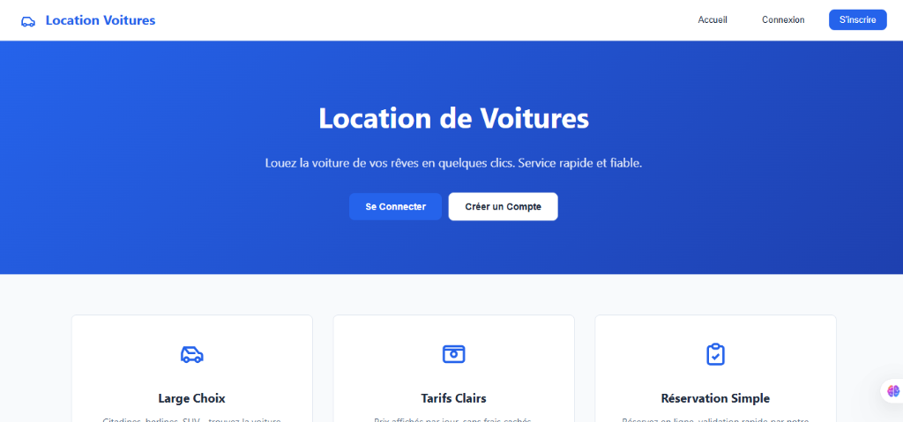
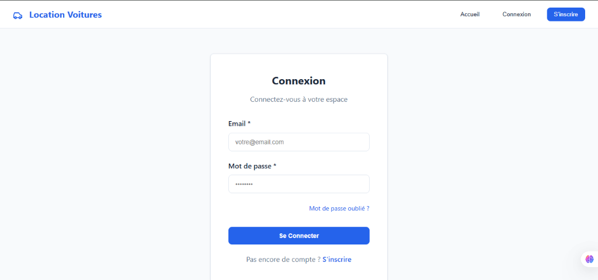
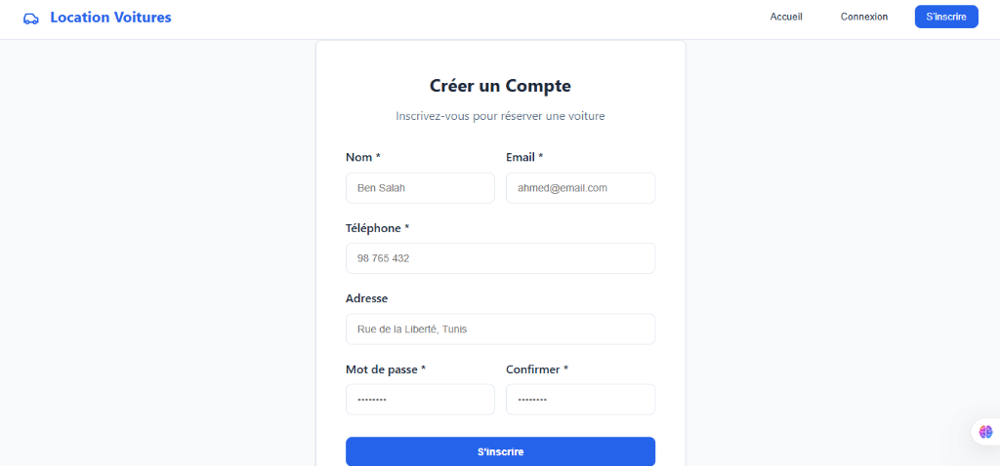
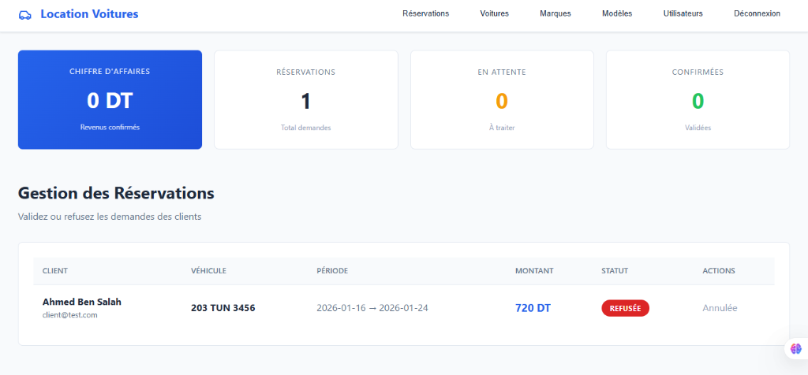

# 🚗 GestionLocationVoiture - Application de Location de Voitures

Application web de gestion de location de voitures développée avec Angular 19 et Spring Boot 3.4.

## 📱 Fonctionnalités

### Pour les Clients
- Inscription et Connexion sécurisées
- Consultation des voitures disponibles avec images et détails
- Réservation de voitures avec sélection des dates
- Suivi des réservations (en attente, confirmée, annulée)
- Interface moderne et responsive

### Pour les Administrateurs
- Tableau de bord avec statistiques (CA, réservations, véhicules)
- Gestion des marques (CRUD complet)
- Gestion des modèles (CRUD complet avec liaison aux marques)
- Gestion des voitures (ajout, modification, suppression, upload d'images)
- Gestion des utilisateurs (création, modification, suppression, rôles)
- Gestion des réservations (confirmation, annulation)

## 🛠️ Technologies Utilisées

- **Frontend** : Angular 19, TypeScript, RxJS, Angular Signals
- **Backend** : Spring Boot 3.4, Spring Data JPA, Lombok
- **Base de données** : MySQL 8.0
- **Build** : Maven, npm
- **Architecture** : REST API + SPA (Single Page Application)

## 📂 Structure du Projet

```
GestionLocationVoiture/
├── src/main/java/com/GestionLocationVoiture/
│   ├── controllers/
│   │   ├── AuthController.java
│   │   ├── CarController.java
│   │   ├── UserController.java
│   │   ├── ReservationController.java
│   │   ├── BrandController.java
│   │   └── ModelController.java
│   ├── services/
│   │   ├── CarServiceImpl.java
│   │   ├── UserServiceImpl.java
│   │   ├── ReservationServiceImpl.java
│   │   ├── BrandServiceImpl.java
│   │   └── ModelServiceImpl.java
│   ├── entities/
│   │   ├── Car.java
│   │   ├── User.java
│   │   ├── Reservation.java
│   │   ├── Brand.java
│   │   └── Model.java
│   ├── dto/
│   ├── mapper/
│   └── repositories/
│
├── frontend/src/app/
│   ├── components/
│   │   ├── login/
│   │   ├── register/
│   │   ├── home/
│   │   ├── catalogue/
│   │   ├── admin/
│   │   ├── car-list/
│   │   ├── user/
│   │   ├── brand/
│   │   ├── model/
│   │   ├── reservation/
│   │   └── my-reservations/
│   ├── services/
│   └── models/
```

## 🚀 Installation

1. Cloner le repository
   ```bash
   git clone https://github.com/walajl/GestionlocationvoituresSpringBoot.git
   ```

2. Configurer la base de données MySQL
   ```sql
   CREATE DATABASE GestionLocationVoiture;
   ```

3. Configurer les credentials dans `src/main/resources/application.properties`
   ```properties
   spring.datasource.username=root
   spring.datasource.password=votre_mot_de_passe
   ```

4. Démarrer le Backend
   ```bash
   ./mvnw spring-boot:run
   ```
   Le serveur démarre sur `http://localhost:8081`

5. Démarrer le Frontend
   ```bash
   cd frontend
   npm install
   npm start
   ```
   L'application démarre sur `http://localhost:4200`

## 📸 Captures d'écran

| Accueil | Connexion |
|:-------:|:---------:|
|  |  |

| Inscription | Dashboard Admin |
|:-----------:|:---------------:|
|  |  |

## 👥 Auteur

- Walaeddine Jlassi - Développeur

## 📄 Licence

Ce projet est sous licence MIT - voir le fichier LICENSE pour plus de détails.
